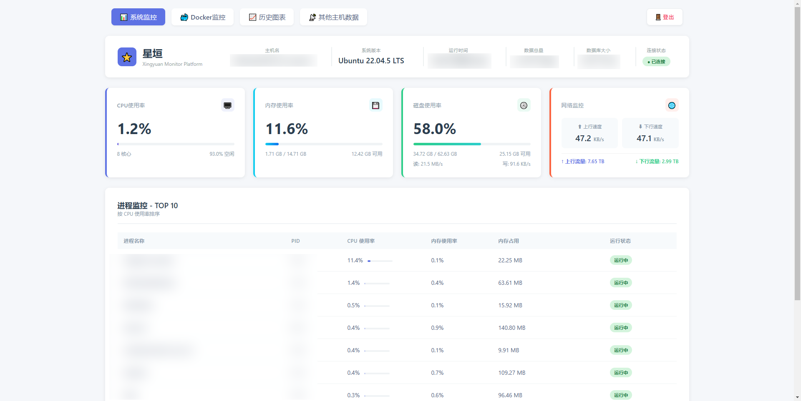
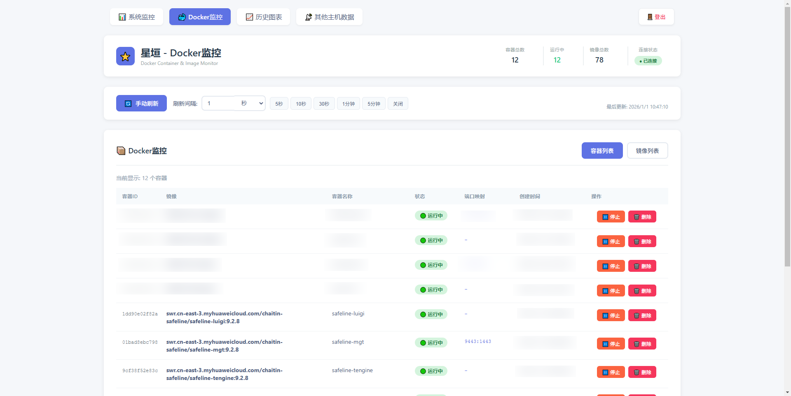
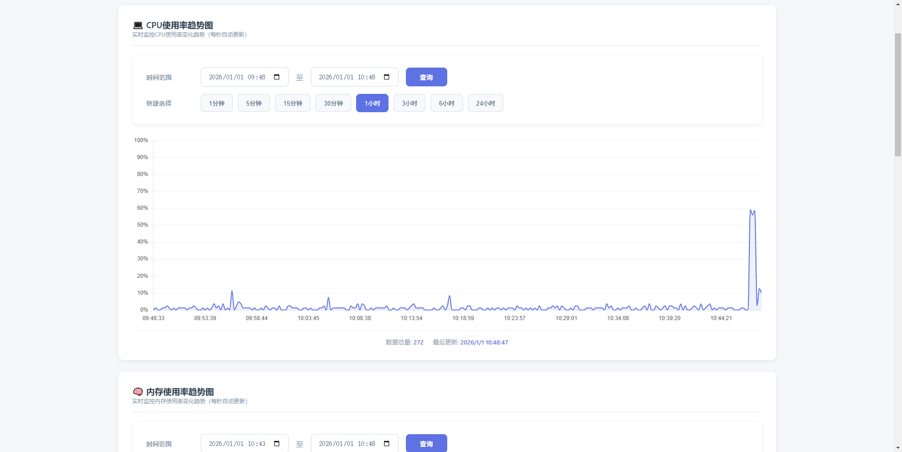
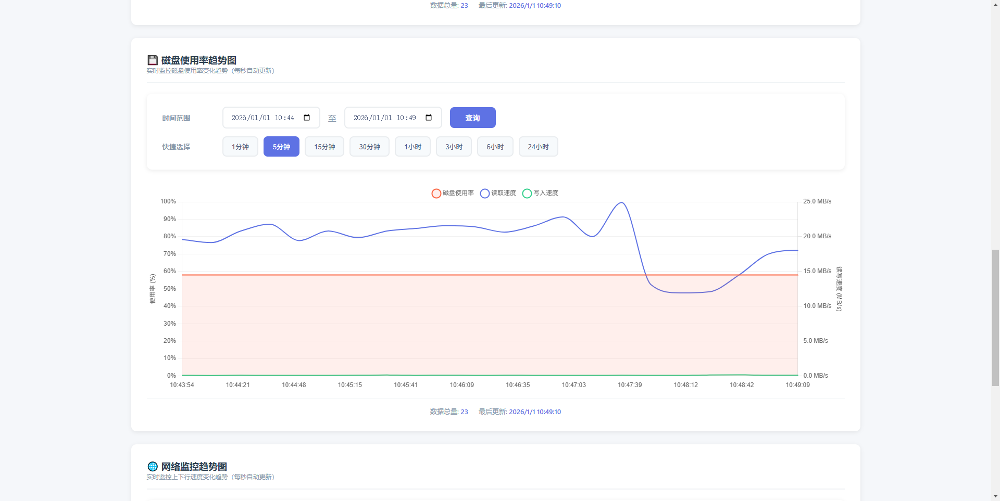
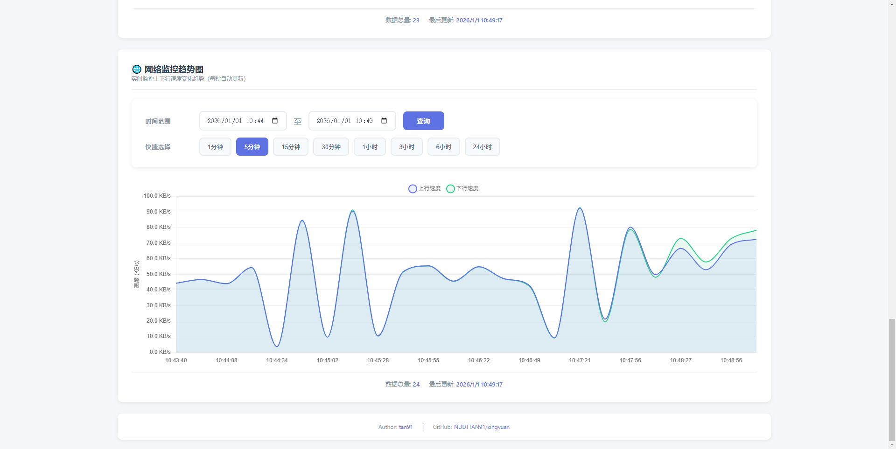
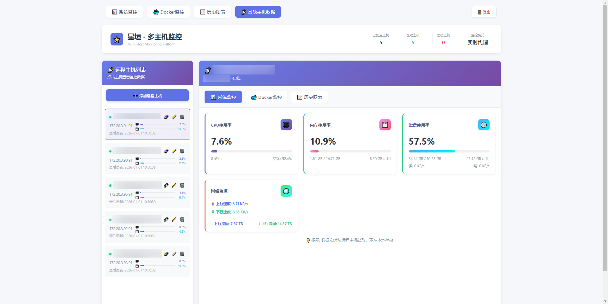

# 星垣（Xingyuan）

<p align="center">
  
</p>

<p align="center">
  <strong>轻量级 Linux 服务器实时监控平台</strong>
</p>

<p align="center">
  <a href="https://github.com/NUDTTAN91"></a>
  <a href="https://hub.docker.com/u/nudttan91"></a>
  <a href="https://blog.csdn.net/ZXW_NUDT"></a>
</p>

<p align="center">
  <a href="https://golang.org"></a>
  <a href="https://www.docker.com"></a>
  <a href="LICENSE"></a>
  
</p>

<p align="center">
  
  
  
  
  
</p>

---

## 简介

星垣是一款轻量级的 Linux 服务器监控工具，采用 Go 语言开发，支持 Docker 一键部署。提供实时系统监控、Docker 容器管理、历史数据图表、多主机集中管理等功能。

## 功能特性

- **实时监控**：CPU、内存、磁盘、网络等核心指标秒级刷新
- **进程监控**：TOP 10 进程列表，按 CPU 使用率排序
- **Docker 管理**：容器状态监控、启动/停止/重启/删除操作
- **历史图表**：支持自定义时间范围的历史数据可视化
- **多主机管理**：集中管理多台服务器的监控数据
- **安全认证**：JWT Token 认证，支持登录锁定保护
- **数据持久化**：SQLite 存储，支持 WAL 模式高性能写入
- **容器化部署**：Docker 一键部署，开箱即用

## 技术栈

| 组件 | 技术 |
|------|------|
| 后端 | Go 1.21、Gin、gorilla/websocket |
| 前端 | 原生 HTML/CSS/JS、Chart.js |
| 数据库 | SQLite (WAL 模式) |
| 认证 | JWT (golang-jwt/jwt) |
| 系统采集 | gopsutil |
| 部署 | Docker、Docker Compose |

## 快速开始

### 前置要求

- Docker 20.10+
- Docker Compose v2+

### 部署步骤

1. **克隆仓库**

```bash
git clone https://github.com/NUDTTAN91/xingyuan.git
cd xingyuan
```

2. **配置（可选）**

编辑 `docker-compose.yml`，修改以下环境变量：

```yaml
environment:
  - SERVER_PORT=81                    # 服务端口
  - ADMIN_USERNAME=root               # 管理员用户名
  - ADMIN_PASSWORD=root               # 管理员密码（请修改为强密码）
  - JWT_SECRET=your-secret-key        # JWT 密钥（请修改）
```

3. **启动服务**

```bash
docker compose up -d
```

4. **访问系统**

浏览器访问 `http://服务器IP:81`

默认账号：`root` / `root`

## 目录结构

```
xingyuan/
├── main.go                 # 程序入口
├── Dockerfile              # Docker 构建文件
├── docker-compose.yml      # Docker Compose 配置
├── go.mod                  # Go 模块定义
├── auth/                   # 认证模块
│   └── auth.go
├── collector/              # 数据采集模块
│   ├── collector.go
│   ├── cpu.go
│   ├── memory.go
│   ├── disk.go
│   ├── network.go
│   ├── docker.go
│   ├── process.go
│   └── system.go
├── database/               # 数据库模块
│   ├── db.go
│   ├── schema.go
│   └── metrics.go
├── server/                 # Web 服务模块
│   └── server.go
├── remote/                 # 远程主机管理
│   └── remote.go
├── static/                 # 前端静态文件
│   ├── index.html
│   ├── login.html
│   ├── docker-monitor.html
│   ├── history-chart.html
│   ├── remote-hosts.html
│   ├── css/
│   └── js/
└── data/                   # 数据存储目录
    └── monitor.db
```

## 配置说明

### 环境变量

| 变量名 | 默认值 | 说明 |
|--------|--------|------|
| `TZ` | Asia/Shanghai | 时区，监控数据时间戳的唯一时区来源；部署后请勿变更，否则历史图表时间轴会偏移（启动日志会告警） |
| `SERVER_PORT` | 80 | 服务监听端口 |
| `ADMIN_USERNAME` | admin | 管理员用户名，仅可通过 docker-compose.yml 配置（无网页修改功能），修改后需重建容器 |
| `ADMIN_PASSWORD` | -（必填） | 管理员密码，未配置则拒绝启动；仅可通过 docker-compose.yml 配置，支持明文或 bcrypt 哈希（`$2a$` 前缀，compose 中 `$` 需写成 `$$`） |
| `JWT_SECRET` | -（建议配置） | JWT 签名密钥，未配置时每次启动随机生成（重启后需重新登录） |
| `ACCESS_TOKEN_EXPIRE_MINUTES` | 120 | Access Token 有效期（分钟） |
| `REFRESH_TOKEN_EXPIRE_DAYS` | 7 | Refresh Token 有效期（天） |
| `MAX_LOGIN_ATTEMPTS` | 5 | 最大登录失败次数 |
| `LOGIN_LOCK_MINUTES` | 15 | 登录锁定时间（分钟） |
| `TRUSTED_PROXIES` | -（默认不信任） | 可信反向代理 IP/CIDR（逗号分隔）；不配置时忽略 X-Forwarded-For 等代理头，防止伪造来源 IP 绕过登录锁定 |
| `METRICS_RETENTION_DAYS` | 30 | 原始秒级数据保留天数，超期数据自动压缩为分钟级聚合数据（历史图表仍可查看） |

### Docker Compose 挂载说明

```yaml
volumes:
  - /proc:/host/proc:ro              # 宿主机 /proc（只读）
  - /sys:/host/sys:ro                # 宿主机 /sys（只读）
  - /:/host:ro                       # 宿主机根目录（只读）
  - /var/run/docker.sock:/var/run/docker.sock:ro  # Docker Socket
  - ./data:/app/data                 # 数据持久化目录
```

## 界面预览

### 系统监控
实时展示 CPU、内存、磁盘、网络使用情况及 TOP 10 进程列表。



### Docker 监控
查看容器运行状态，支持启动、停止、重启、删除等操作。



### 历史图表
可视化展示历史监控数据，支持自定义时间范围查询。








### 多主机管理

集中管理多台服务器，统一查看各主机监控数据。



## API 接口

> 除 `/api/login`、`/api/refresh`、`/api/health`、`/api/ws` 外，其余接口均需在请求头携带 `Authorization: Bearer <access_token>`。

### 认证与系统

| 方法 | 路径 | 说明 |
|------|------|------|
| POST | `/api/login` | 用户登录（公开） |
| POST | `/api/logout` | 用户登出 |
| POST | `/api/refresh` | 刷新 Token（公开） |
| GET | `/api/verify` | 验证 Token |
| GET | `/api/health` | 健康检查（公开，供 Docker healthcheck 使用） |

### 监控数据

| 方法 | 路径 | 说明 |
|------|------|------|
| GET | `/api/metrics` | 获取实时监控数据 |
| GET | `/api/docker` | 获取 Docker 信息 |
| GET | `/api/ws` | WebSocket 实时推送（Token 通过 `Sec-WebSocket-Protocol` 子协议传递，兼容 `?token=` 查询参数） |

### 历史数据与统计

| 方法 | 路径 | 说明 |
|------|------|------|
| GET | `/api/history/cpu` | CPU 历史数据（`start`/`end` 查询参数，自动采样） |
| GET | `/api/history/memory` | 内存历史数据 |
| GET | `/api/history/disk` | 磁盘历史数据 |
| GET | `/api/history/network` | 网络历史数据 |
| GET | `/api/stats/database` | 数据库统计（总记录数、数据大小） |
| GET | `/api/stats/timerange` | 数据时间范围（最早/最晚时间戳） |

### Docker 操作

| 方法 | 路径 | 说明 |
|------|------|------|
| POST | `/api/docker/container/stop` | 停止容器（body: `{"container_id": "..."}`，ID 须为 12~64 位十六进制） |
| POST | `/api/docker/container/restart` | 重启容器 |
| POST | `/api/docker/container/delete` | 删除容器 |

### 远程主机管理

| 方法 | 路径 | 说明 |
|------|------|------|
| GET | `/api/remote/hosts` | 获取主机列表（不返回密码） |
| POST | `/api/remote/hosts` | 添加主机（密码 AES-256-GCM 加密存储） |
| PUT | `/api/remote/hosts/:id` | 更新主机（密码留空则保留原密码） |
| DELETE | `/api/remote/hosts/:id` | 删除主机 |
| GET | `/api/remote/hosts/:id/status` | 检查单台主机在线状态（含凭据有效性校验） |
| GET | `/api/remote/hosts/status/all` | 并发检查所有主机状态 |

### 远程数据代理

| 方法 | 路径 | 说明 |
|------|------|------|
| GET | `/api/remote/:host_id/metrics` | 代理获取远程主机实时监控数据 |
| GET | `/api/remote/:host_id/docker` | 代理获取远程主机 Docker 信息 |
| GET | `/api/remote/:host_id/history/{cpu,memory,disk,network}` | 代理获取远程主机历史数据 |

## 常见问题

### 1. 如何修改默认端口？

编辑 `docker-compose.yml`，修改 `SERVER_PORT` 环境变量：

```yaml
environment:
  - SERVER_PORT=8080
```

### 2. 如何查看日志？

```bash
docker logs -f xingyuan-monitor
```

### 3. 如何备份数据？

数据存储在 `./data/monitor.db`，直接备份该文件即可。

### 4. 如何重置密码？

修改 `docker-compose.yml` 中的 `ADMIN_PASSWORD`，然后重启容器：

```bash
docker compose down && docker compose up -d
```

## 开发构建

### 本地开发

```bash
# 安装依赖
go mod download

# 运行
go run .
```

### Docker 构建

```bash
docker compose build --no-cache
docker compose up -d
```

## 许可证

本项目采用 MIT 许可证，详见 [LICENSE](LICENSE) 文件。

## 作者

- **tan91**
- 博客：[https://blog.csdn.net/ZXW_NUDT](https://blog.csdn.net/ZXW_NUDT)
- GitHub：[https://github.com/NUDTTAN91](https://github.com/NUDTTAN91)

## 致谢

- [Gin](https://github.com/gin-gonic/gin) - HTTP Web 框架
- [gopsutil](https://github.com/shirou/gopsutil) - 系统信息采集库
- [Chart.js](https://www.chartjs.org/) - 图表库
- [gorilla/websocket](https://github.com/gorilla/websocket) - WebSocket 库

---

<p align="center">
  如果觉得项目不错，欢迎 Star ⭐ 支持！
</p>
